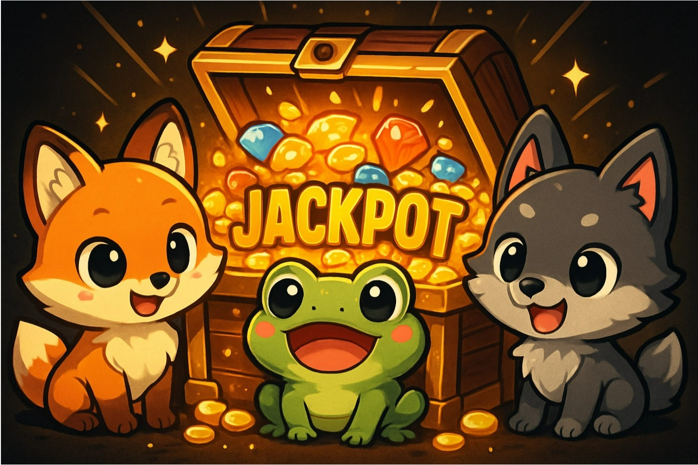

# Jackpet – A Decentralized Lucky Pet Game on Arbitrum

## Intro
Jackpet is a decentralized, luck-powered pet game on Arbitrum, where players stake 0.01 ETH to roll adorable pets, compete for jackpots, and share rewards from an ever-growing on-chain prize pool—secured by verifiable randomness and dedicated to long-term charity impact.

## Project Overview

**Jackpet** is a decentralized, chain-verifiable lucky pet game built on **Arbitrum**, designed to deliver excitement, fairness, and a strong sense of fortune to every player. By combining adorable pet-themed gameplay with transparent on-chain mechanics, Jackpet offers a fun yet trustworthy decentralized lottery experience.

Players join the game by purchasing a ticket (0.01 ETH) and may optionally select a multiplier of up to **100×**, amplifying both risk and reward. In each round, **12 pets** are randomly drawn from a collection of **24 pets**, consisting of **3 types with 8 variations each**. All randomness is powered by **Chainlink VRF**, ensuring outcomes are fully verifiable, tamper-proof, and provably fair.

---

## How It Works

- **Ticket Fee**: 0.01 ETH per game  
- **Initial Liquidity**: The project injects ETH into the contract to bootstrap rewards  
- **Prize Pool Growth**: 1% of each losing ticket is automatically added to a secure on-chain prize pool  
- **Multiplier Option**: Players may choose multipliers up to 100× to increase excitement  
- **Fairness Guarantee**: Chainlink VRF ensures decentralized, auditable randomness for every draw  

The prize pool is governed entirely by smart contracts and **cannot be withdrawn by the project team** under any circumstances.

---

## Reward Rules

Player rewards are determined by the final pet combination drawn in each game. Rewards consist of two parts:  
1. **A ticket-based payout multiplier**  
2. **A percentage share of the current prize pool**

| Pet Combination | Ticket Multiplier | Prize Pool Share |
|-----------------|------------------|------------------|
| `{8,4,0}`       | 11×              | 99% of prize pool |
| `{8,3,1}`       | 6×               | 30% of current prize pool |
| `{8,2,2}`       | 6×               | 30% of current prize pool |
| `{7,5,0}`       | 6×               | 30% of current prize pool |
| `{7,4,1}`       | 4×               | 10% of current prize pool |
| `{7,3,2}`       | 2×               | 10% of current prize pool |
| `{6,6,0}`       | 6×               | 30% of current prize pool |
| `{6,5,1}`       | 2×               | 10% of current prize pool |
| `{6,4,2}`       | 1.1×             | 0% |
| `{6,3,3}`       | 1.2×             | 0% |
| `{5,5,2}`       | 1.2×             | 0% |
| `{4,4,4}`       | 1.1×             | 0% |
| `{5,4,3}`       | 0×               | Loss |

### Jackpot Highlight

The legendary combination **`{8,4,0}`** represents the ultimate jackpot in Jackpet.  
Winning this combination rewards the player with **10× the ticket fee (excluding the original ticket)** and **99% of the entire prize pool**, creating a rare but highly thrilling moment of on-chain fortune.

---

## Social Commitment

Jackpet is designed with long-term responsibility in mind.

- The prize pool is **fully locked by smart contract logic** and can only be distributed according to predefined game rules  
- **20% of the contract’s annual balance** will be donated to charitable causes each year  

By combining entertainment with social good, Jackpet aims to ensure that on-chain fun also creates real-world positive impact.

---

## Vision

Jackpet aspires to become more than just a game:

- 🎮 Deliver joyful, engaging gameplay through cute and memorable pet characters  
- 🎲 Guarantee **provably fair and transparent randomness** using decentralized VRF  
- 🍀 Give every player a genuine sense of luck and opportunity  
- 🔍 Build trust through fully on-chain, auditable game logic  
- 🌍 Grow into a sustainable, community-driven decentralized gaming protocol  

Originally created for the **Arbitrum APAC Mini Hackathon**, Jackpet is designed with real-world adoption in mind and aims to evolve into a fully incubated project within the **Arbitrum ecosystem**, offering a fair, transparent, and delightful decentralized lottery experience for players around the world.

## License

- Smart contracts are released under the Business Source License (BSL 1.1).
- Frontend code is licensed under GNU AGPL v3.0.
- Commercial use requires explicit permission from the Jackpet team.

This licensing model is designed to ensure transparency, fairness,
and long-term sustainability of the Jackpet ecosystem.
