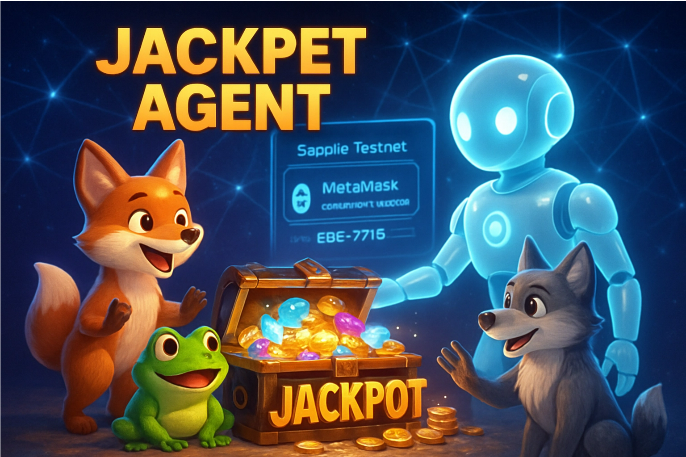

# Jackpet Agent – An Agentic, Chain-Agnostic On-Chain Game

## Intro
Jackpet Agent is a chain-agnostic, agentic on-chain pet game, deployed on Sepolia, where players grant a single ERC-7715 permission and let an autonomous agent auto-play multiple rounds with enforced limits via MetaMask Advanced Permissions.

> **Hackathon Notice:**  
> This project includes dedicated sections for **Advanced Permissions Usage** and **Social Media** as required by the MetaMask Advanced Permissions Dev Cook-Off.

## Project Overview

**Jackpet Agent** is an agentic, chain-agnostic, luck-powered on-chain pet game built to showcase **MetaMask Advanced Permissions**. Currently deployed on **Sepolia** as a reference network, Jackpet Agent allows players to grant a **single ERC-7715 permission** and delegate gameplay to an autonomous agent that can automatically start and execute multiple game rounds on their behalf—without repeated wallet confirmations.

By combining adorable pet-themed gameplay, verifiable on-chain randomness, and permission-based automation, Jackpet Agent demonstrates how **Advanced Permissions (ERC-7715 + EIP-7702)** unlock seamless, trust-minimized autonomous gaming experiences.

---

## Why Jackpet Agent

Traditional on-chain games require users to manually approve every action, resulting in frequent wallet pop-ups and fragmented gameplay. Jackpet Agent reimagines this flow:

* ✅ One-time, limited permission via ERC-7715
* 🤖 Autonomous agent executes multiple game rounds
* 🔐 All actions strictly enforced on-chain
* 🔄 Permissions are revocable at any time

This makes Jackpet Agent a native example of an **agentic dApp** powered by Advanced Permissions.

---

## Core Gameplay

Players participate in a luck-based pet game by authorizing an agent to start games within clearly defined constraints.

* **Ticket Fee**: 0.01 ETH per game
* **Authorization Model**: Single ERC-7715 permission (spend + game-start)
* **Execution**: Autonomous agent triggers game rounds
* **Automation**: Multiple rounds executed without further user interaction

Each round randomly draws **12 pets** from a set of **24 pets**, composed of **3 types with 8 variations each**.

---

## Verifiable Randomness

All randomness in Jackpet Agent is powered by **Chainlink VRF**, ensuring that every game outcome is:

* Fully on-chain
* Tamper-proof
* Publicly auditable
* Provably fair

This guarantees that neither the agent nor the project team can influence game results.

---

## Prize Pool Mechanics

* **Initial Liquidity**: Bootstrapped by the project
* **Prize Pool Growth**: 1% of each losing ticket is automatically added to an on-chain prize pool
* **Custody**: Fully controlled by smart contracts
* **Team Access**: ❌ The project team cannot withdraw funds under any circumstances

---

## Reward Rules

Rewards are determined by the final pet combination drawn in each round. Each winning outcome consists of:

1. A **ticket-based payout multiplier**
2. A **percentage share of the current prize pool**

| Pet Combination | Ticket Multiplier | Prize Pool Share |
| --------------- | ----------------- | ---------------- |
| `{8,4,0}`       | 11×               | 99%              |
| `{8,3,1}`       | 6×                | 30%              |
| `{8,2,2}`       | 6×                | 30%              |
| `{7,5,0}`       | 6×                | 30%              |
| `{7,4,1}`       | 4×                | 10%              |
| `{7,3,2}`       | 2×                | 10%              |
| `{6,6,0}`       | 6×                | 30%              |
| `{6,5,1}`       | 2×                | 10%              |
| `{6,4,2}`       | 1.1×              | 0%               |
| `{6,3,3}`       | 1.2×              | 0%               |
| `{5,5,2}`       | 1.2×              | 0%               |
| `{4,4,4}`       | 1.1×              | 0%               |
| `{5,4,3}`       | 0×                | Loss             |

---

## Jackpot Highlight

The legendary combination **`{8,4,0}`** represents the ultimate jackpot.

* 🎉 **11× ticket payout** (excluding original stake)
* 🏆 **99% of the entire prize pool**

This rare outcome creates a highly memorable, fully verifiable on-chain jackpot moment—executed autonomously by the agent.

---

## Advanced Permissions Design

Jackpet Agent uses **MetaMask Advanced Permissions** as a core primitive:

* **Standard**: ERC-7715
* **Execution Layer**: EIP-7702
* **Scope**: Limited ETH spend + game-start calls
* **Constraints**: Per-round cost, max rounds, validity period

All permissions are:

* Enforced on-chain
* Transparent to users
* Revocable at any time

---

## Social Commitment

Jackpet Agent is designed with long-term responsibility in mind:

* 🔒 Prize pool funds are locked by smart contracts
* ❤️ **20% of the contract’s annual balance** is committed to charitable donations

Automation does not compromise accountability—every action remains verifiable and governed by code.

---

## Vision

Jackpet Agent aims to demonstrate the future of autonomous on-chain applications:

* 🤖 Agent-driven gameplay with strict permission boundaries
* 🔐 Trust-minimized automation using Advanced Permissions
* 🎲 Provably fair randomness
* 🧩 Chain-agnostic architecture for EIP-7702–enabled networks
* 🌍 A blueprint for agentic games and autonomous dApps

---

## Hackathon Context
Jackpet Agent is a **new project built specifically for the MetaMask Advanced Permissions Dev Cook-Off**. While inspired by the original Jackpet game mechanics, the project has been re-architected from the ground up to highlight **ERC-7715 permissions, agent-based execution, and autonomous gameplay**.

It serves as a concrete example of how Advanced Permissions unlock seamless, secure, and creative agentic user experiences.

## ⭐ Advanced Permissions Usage
Jackpet Agent is built explicitly around **MetaMask Advanced Permissions**, using a single ERC-7715 authorization to enable fully autonomous, multi-round on-chain gameplay.

### Requesting Advanced Permissions
Players grant a one-time, scoped permission via MetaMask to allow the agent to execute game actions on their behalf.  
This permission explicitly defines:

- Maximum ETH spend per round
- Maximum number of executable rounds
- Validity period
- Allowed contract calls (game start & execution)

**Code reference – Requesting Advanced Permissions:**
- https://github.com/andOneBasketball/Jackpet-Agent/blob/739494f240d2d0b40a1d85cd270179d991e5770d/frontend/src/hooks/useERC7715.ts#L530

This flow allows users to review and fine-tune permission limits directly in MetaMask before approving, ensuring transparency and informed consent.

### Redeeming (Using) Advanced Permissions

After approval, the autonomous agent redeems the granted ERC-7715 permission to automatically start and execute multiple game rounds without requiring repeated wallet confirmations.

All executions:
- Are strictly constrained by the originally approved permission scope
- Are fully enforced on-chain through contract-level checks
- Execute deterministically without any off-chain trust assumptions

**Code reference – Redeeming Advanced Permissions:**
- https://github.com/andOneBasketball/Jackpet-Agent/blob/739494f240d2d0b40a1d85cd270179d991e5770d/frontend/src/hooks/useBundler.ts#L107

Permission lifecycle management, including revocation or expiration, is handled by MetaMask as part of the Advanced Permissions framework, keeping user control at the wallet level while enabling seamless autonomous execution.

## ⭐ Social Media
We documented and shared the full development journey of Jackpet Agent on X, showcasing how **MetaMask Advanced Permissions** enabled autonomous gameplay, reduced repeated wallet prompts, and significantly improved the user experience.
🔗 Project journey on X (tagging @MetaMaskDev):  
https://x.com/0xSevenK/status/2006622562298769635?s=20

## License

- Smart contracts are released under the Business Source License (BSL 1.1).
- Frontend code is licensed under GNU AGPL v3.0.
- Commercial use requires explicit permission from the Jackpet team.

This licensing model is designed to ensure transparency, fairness,
and long-term sustainability of the Jackpet ecosystem.
